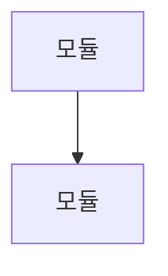

## Summary
<!-- 변경 사항을 1~3줄로 요약해주세요 -->

-

---

## System Architecture
<!-- 시스템 아키텍처 mermaid 다이어그램을 포함해주세요 (필수) -->

---

## Changes (변경 내역)
<!-- 주요 변경 파일/모듈을 설명해주세요 -->

| 모듈 | 변경 내용 |
|------|----------|
|  |  |

---

## Key Points (중점 사항)
<!-- 리뷰어가 특히 집중해서 봐야 할 부분을 작성해주세요 -->

-

---

## Test (검증 방법)
<!-- 검증 방법 체크리스트를 작성해주세요 -->

- [ ] `./gradlew build` 성공
- [ ]
