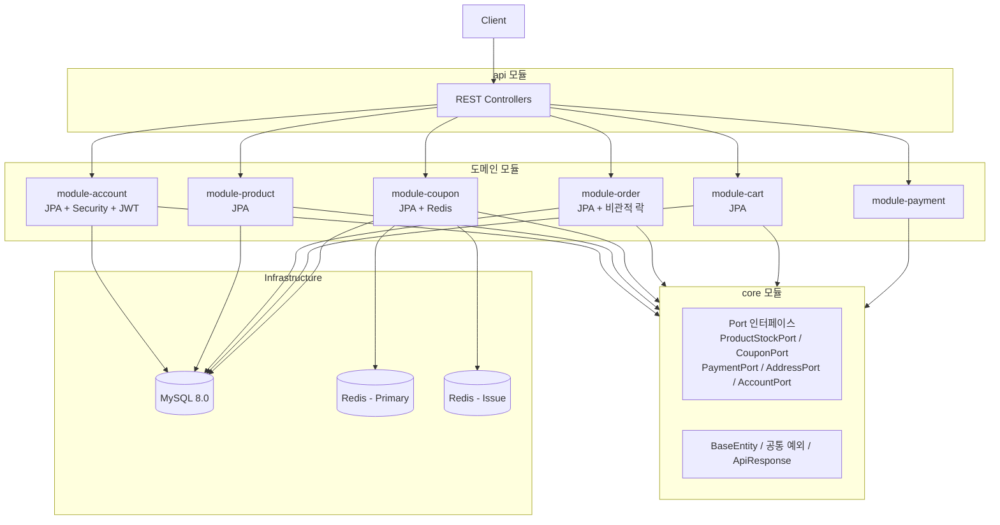
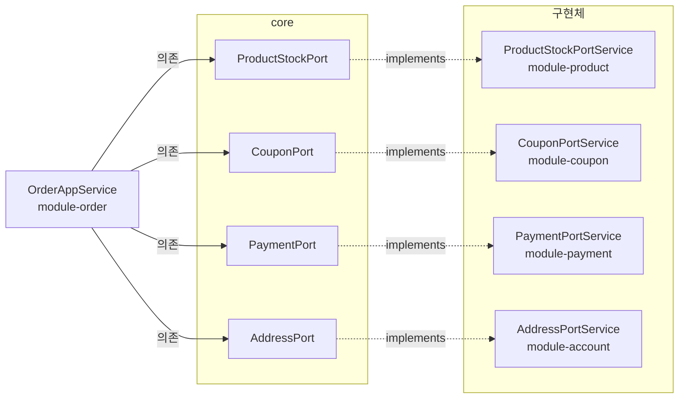
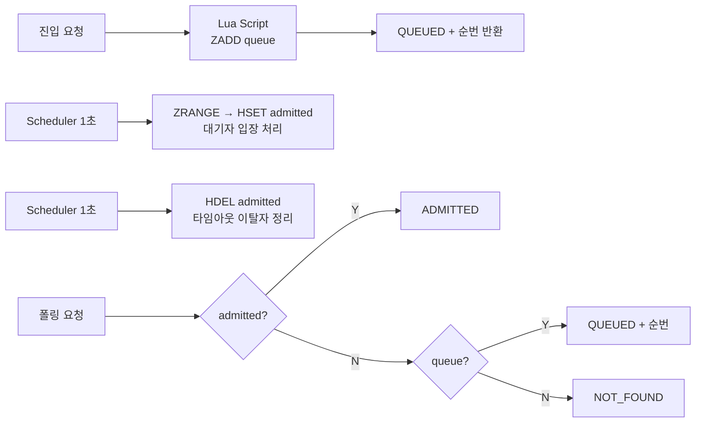
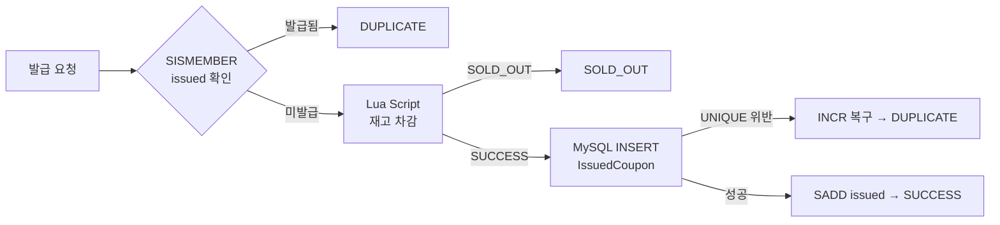
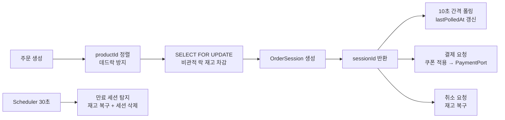

# Zerofive Store

Spring Boot 기반 Gradle 멀티모듈 이커머스 백엔드

## 기술 스택

| 분류 | 기술 | 버전 |
|------|------|------|
| Language | Java | 21 |
| Framework | Spring Boot | 3.4.2 |
| Database | MySQL | 8.0 |
| Cache | Redis | 7 |
| ORM | Spring Data JPA / Hibernate | - |
| Auth | Spring Security + JWT (JJWT) | 0.12.6 |
| API Docs | SpringDoc OpenAPI | 2.8.4 |
| Build | Gradle (멀티모듈) | 8.x |
| Container | Docker / Docker Compose | - |
| Test | JUnit 5 + Testcontainers | 1.20.4 |
| Monitoring | Grafana + InfluxDB | 10.2.0 / 1.8 |
| Load Test | k6 | - |

---

## 프로젝트 구조

```
zerofive-store/
├── api/                  # Spring Boot 실행 모듈 (REST Controller, Config)
├── core/                 # 공통 모듈 (BaseEntity, Port 인터페이스, 예외, 응답)
├── module-account/       # 계정 도메인 (회원가입, 로그인, JWT, 배송지)
├── module-product/       # 상품 도메인 (상품 조회, 재고 관리)
├── module-coupon/        # 쿠폰 도메인 (발급, 대기열, Redis Lua Script)
├── module-cart/          # 장바구니 도메인
├── module-order/         # 주문 도메인 (주문 세션, 결제, 재고 차감)
├── module-payment/       # 결제 도메인 (Port 구현체)
├── docker-compose.yml    # MySQL, Redis x2, API, InfluxDB, Grafana, k6
└── Dockerfile            # Multi-stage 빌드 (JDK 21 → JRE 21)
```

### 모듈별 의존성

| 모듈 | 주요 의존성 |
|------|------------|
| **api** | Spring Web, JPA, Redis, Security, SpringDoc, 전체 도메인 모듈 |
| **core** | Spring Web, JPA, Redis, Security, Validation, SpringDoc, JJWT |
| **module-account** | core, JPA, Security, JJWT |
| **module-product** | core, JPA |
| **module-coupon** | core, JPA, Redis |
| **module-order** | core, JPA |
| **module-cart** | core, JPA |
| **module-payment** | core, Spring Boot Starter |

---

## 시스템 아키텍처

### 전체 구조



### Port 인터페이스 기반 의존성 역전

`core` 모듈에 Port 인터페이스를 정의하고, 각 도메인 모듈이 구현체를 제공합니다. `module-order`는 Port 인터페이스에만 의존하여 도메인 간 결합도를 낮춥니다.



---

## 주요 기능

### 인증/인가

- JWT 기반 Stateless 인증 (HMAC-SHA256)
- BCrypt 비밀번호 암호화
- Spring Security 필터 체인 (`JwtAuthenticationFilter`)

### 쿠폰 대기열

Redis ZSET 기반 선착순 대기열 시스템



### 쿠폰 발급

Redis Lua Script 원자적 재고 차감 + MySQL UNIQUE 제약 이중 중복 방지



### 주문 처리

재고 선차감 + 폴링 기반 세션 유지 + 타임아웃 자동 복구



---

## 데이터베이스 구조

### Dual Redis

| 인스턴스 | 포트 | 용도 | 데이터 |
|---------|------|------|--------|
| Primary | 6379 | 대기열, 입장 관리 | `event:{id}:queue` (ZSET), `event:{id}:admitted` (HASH) |
| Issue | 6380 | 쿠폰 발급 | `coupon:{id}:stock` (STRING), `coupon:{id}:issued` (SET) |

### MySQL 테이블

| 모듈 | 테이블 |
|------|--------|
| Account | Account, Address |
| Product | Product |
| Coupon | Coupon, IssuedCoupon |
| Order | Order, OrderItem, OrderSession, OrderSessionItem |
| Cart | Cart, CartItem |

---

## API 엔드포인트

| 모듈 | 메소드 | 경로 | 설명 | 인증 |
|------|--------|------|------|------|
| 계정 | POST | `/api/accounts/signup` | 회원가입 | X |
| 계정 | POST | `/api/accounts/login` | 로그인 | X |
| 상품 | GET | `/api/products` | 상품 목록 | O |
| 상품 | GET | `/api/products/{id}` | 상품 상세 | O |
| 장바구니 | GET | `/api/carts` | 장바구니 조회 | O |
| 장바구니 | POST | `/api/carts/items` | 상품 추가 | O |
| 쿠폰 | POST | `/api/coupons/{id}/issue` | 쿠폰 발급 | O |
| 이벤트 | POST | `/api/events/{id}/queue` | 대기열 진입 | O |
| 이벤트 | GET | `/api/events/{id}/queue/status` | 대기열 상태 | O |
| 이벤트 | POST | `/api/events/{id}/coupons/{id}/issue` | 이벤트 쿠폰 발급 | O |
| 주문 | POST | `/api/orders` | 주문 생성 | O |
| 주문 | POST | `/api/orders/sessions/{id}/polling` | 세션 폴링 | O |
| 주문 | POST | `/api/orders/sessions/{id}/cancel` | 주문 취소 | O |
| 주문 | POST | `/api/orders/payment` | 결제 | O |
| 주문 | GET | `/api/orders` | 주문 목록 | O |

> Swagger UI: `/swagger-ui.html`

---

## 동시성 제어

| 대상 | 전략 | 구현 |
|------|------|------|
| 쿠폰 재고 차감 | Redis Lua Script | 원자적 DECR + 음수 시 INCR 복구 |
| 쿠폰 중복 발급 방지 | Redis SET + MySQL UNIQUE | 2중 방어 (Redis 캐시 + DB 제약) |
| 상품 재고 차감 | 비관적 락 | `SELECT FOR UPDATE` + productId 정렬 (데드락 방지) |
| 대기열 진입 | Redis Lua Script | ZRANK + HEXISTS + ZADD 원자적 처리 |

---

## 빌드 & 실행

### 로컬 개발

```bash
# 빌드
./gradlew build

# 실행 (로컬 MySQL, Redis 필요)
./gradlew :api:bootRun
```

### Docker

```bash
# 전체 스택 실행 (MySQL, Redis x2, API, Grafana, InfluxDB)
docker-compose up -d

# API만 빌드 후 실행
docker-compose up -d --build api
```

---

## 테스트

Testcontainers 기반 통합 테스트 (MySQL 8.4.5, Redis 7.2)

```bash
# 전체 테스트
./gradlew test

# 특정 모듈 테스트
./gradlew :module-order:test
```

### 부하 테스트

```bash
# k6 부하 테스트 (Docker Compose 환경)
docker-compose --profile test up k6
```

Grafana 대시보드: `http://localhost:3000` (admin / admin)
